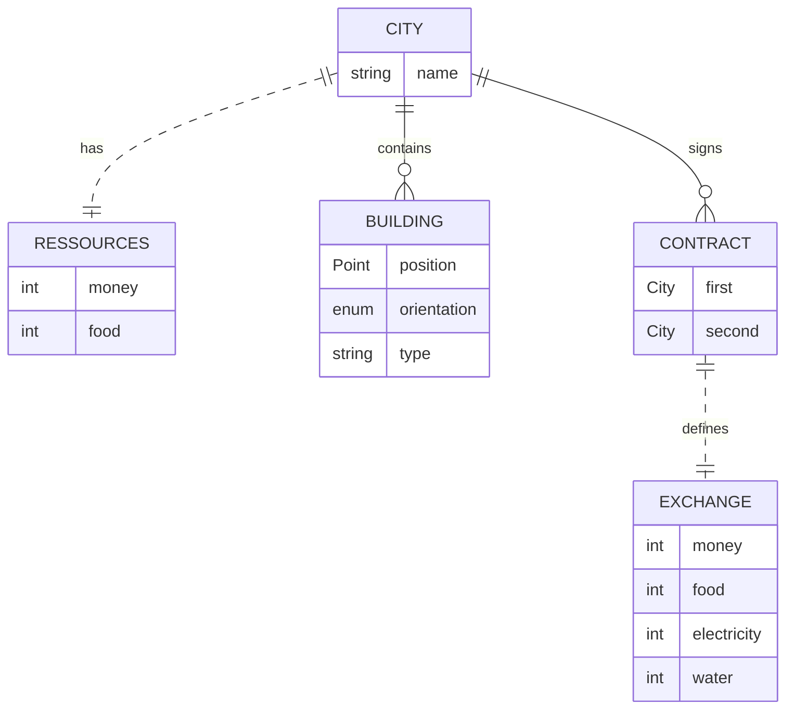

# City

Une `City` est constituée de :

- plusieurs `Building`s
- plusieurs `Contract`s
- une `CityRessources`

## CityRessources

Une `CityRessources` est constituée de :

- une valeur argent
- une valeur nourriture

# Building

Un `Building` est constitué de :

- un `BuildingType`
- une position

## BuildingType

Un `BuildingType` est une énumération contenant :

- `Residential`
- `Commercial`
- `Industry`
- `Entertainment`
- `Services`

# Contract

Un `Contract` est constitué de :

- une `City` A
- une `City` B
- un `Exchange`

## Exchange

Un `Exchange` est constitué de :

- une valeur argent mensuelle
- une valeur nourriture mensuelle
- une valeur éléctricité mensuelle
- une valeur eau mensuelle
